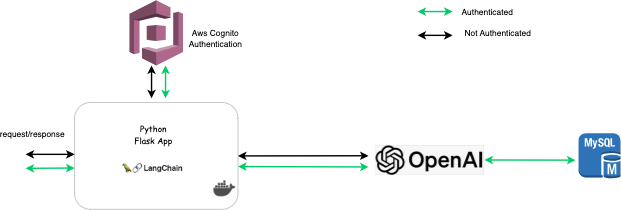
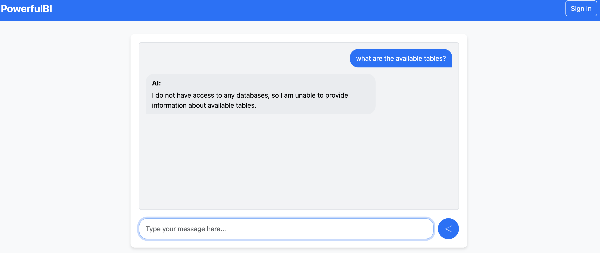
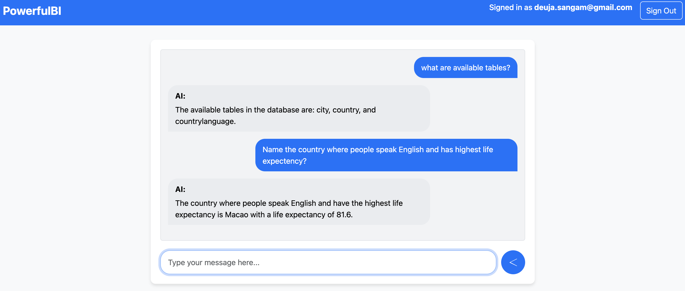

# Project Description : PowerfulBI: ask question about data in database



The project implements `OpenAI` and `langchain` framwork to query against your database. OpenAI has been given `read only permission` to access the data, so there is `no risk of DML(insertion,deletion etc.)`. Furthermore, `AWS cognito` has been used to authenticate the users. The idea is whenever the `authenticated user` ask the question reagarding data, the app responses with the `facts and analytics from database` while `unauthenticated user's` question is answered from llm model with generic answers.

# Use this repo
* create the Aws MySQL database and use world.sql to create schema and populate the data(refer `populate_aws_rds.py` for implementation).
* For database new user credentials for read access refer `read_permission_LLM.py`. use `.env` file from step 5 to use the python code mentioned in step 1 and step 2.
* create Aws Cognito pool and users for the Flask application.
* clone this repo.
* create .env file in root path and provide the environment variables: `OPENAI_API_KEY`,`DB_HOST`,`DB_PORT`,`DB_USER`,`DB_PASSWORD`,`DB_NAME`,`SQL_FILE`,`READ_USER`,`READ_USER_PASSWORD`,`COGNITO_POOL_ID`,`COGNITO_CLIENT_ID`,`COGNITO_REGION`,`FLASK_SECRET_KEY`,`ACCESS_KEY_ID`,`SECRET_ACCESS_KEY`,`ENVIRONMENT`. Here `ACCESS_KEY_ID`,`SECRET_ACCESS_KEY` have been used which is not ideal. Use Service principal or iam role instead. If you are embedding the `ACCESS_KEY_ID`,`SECRET_ACCESS_KEY` directly, don't share to anywhere public.
* Finally, run ```docker compose up```
* Here are two images of powerfulBI chatapp
  <table>
  <tr>
    <td align="center">
      
      <p style="font-size: 12px;">Unauthenticated user interaction</p>
    </td>
    <td align="center">
      
      <p style="font-size: 12px;">Authenticated user interaction</p>
    </td>
  </tr>
</table>
